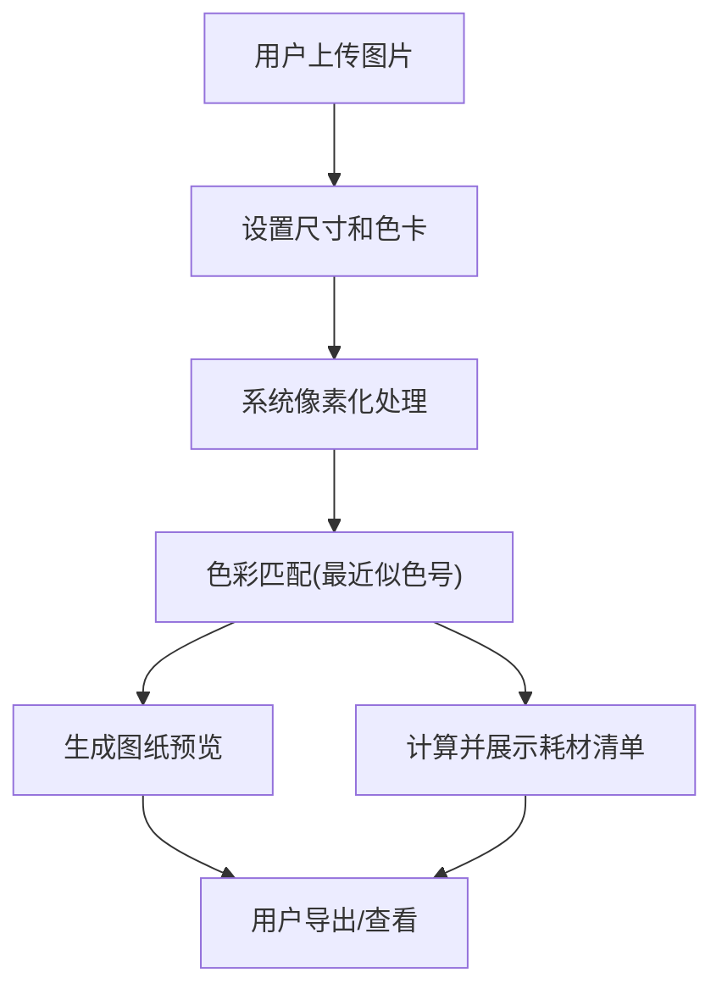

## 1. 产品概述
拼豆教程生成器是一款专为拼豆（Perler Beads/Mard/Artkal）爱好者设计的网页应用。用户只需上传一张图片，应用就能自动将其转换为马赛克像素风格的拼豆图纸，并精确匹配市面上专业的拼豆色号（如 Mard、Perler 等）。同时，系统会自动统计所需的各个色号及其对应的耗材数量，极大地方便了玩家的备料和制作过程。

## 2. 核心功能

### 2.1 用户角色
| 角色 | 注册方式 | 核心权限 |
|------|----------|----------|
| 普通用户 | 无需注册 | 上传图片、生成图纸、查看色号与耗材统计、导出图纸 |

### 2.2 功能模块
1. **工作台页面**：图片上传、参数设置（尺寸、品牌色卡）、图纸预览、耗材统计列表。

### 2.3 页面详情
| 页面名称 | 模块名称 | 功能描述 |
|----------|----------|----------|
| 工作台页面 | 上传模块 | 支持拖拽或点击上传本地图片（JPG/PNG）。 |
| 工作台页面 | 设置模块 | 选择目标拼豆网格尺寸（如 50x50）；选择专业拼豆色卡品牌（默认为 Mard 221色，支持 Perler、Artkal 等）。 |
| 工作台页面 | 预览模块 | 展示转换后的像素马赛克图纸，支持网格叠加，网格内可选择显示色号代码。 |
| 工作台页面 | 统计模块 | 自动汇总所需色号及对应的耗材数量，支持列表视图展示色块、色号和数量。 |

## 3. 核心流程
用户上传图片并设置拼豆参数，系统在前端完成图像像素化和色号匹配，并实时渲染拼豆图纸和统计耗材，用户可直接预览并保存图纸。

## 4. 用户界面设计
### 4.1 设计风格
- **主色调与辅助色**：采用米白色或浅灰背景，搭配温和的马卡龙色系点缀，营造手工制作的温馨、治愈氛围。
- **按钮风格**：带有轻微立体感和圆角的按钮，呼应拼豆的圆润质感。
- **字体与大小**：使用现代且圆润的无衬线字体，确保图纸上网格内的色号字母清晰可读。
- **布局风格**：卡片式工作台布局，左侧/顶部为控制台与耗材统计，右侧/主体为宽大的画布预览区。
- **图标/Emoji风格**：扁平、色彩明快（🎨 🖼️ 🧮 等）。

### 4.2 页面设计总览
| 页面名称 | 模块名称 | UI 元素 |
|----------|----------|---------|
| 工作台页面 | 上传与设置 | 虚线框拖拽区，下拉选择框，滑动条，圆角按钮，流畅的过渡动画。 |
| 工作台页面 | 图纸预览区 | 居中展示的画布，带边框和网格线，支持放大缩小。 |
| 工作台页面 | 耗材统计 | 清晰的列表或网格排列，左侧显示带颜色的圆点，右侧显示色号和数量。 |

### 4.3 响应式设计
- 桌面端优先（Desktop-first），大屏下提供最佳的图纸编辑与查看体验。
- 移动端自适应，控制面板可折叠，图纸支持手势缩放。
