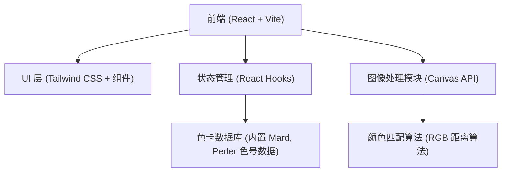
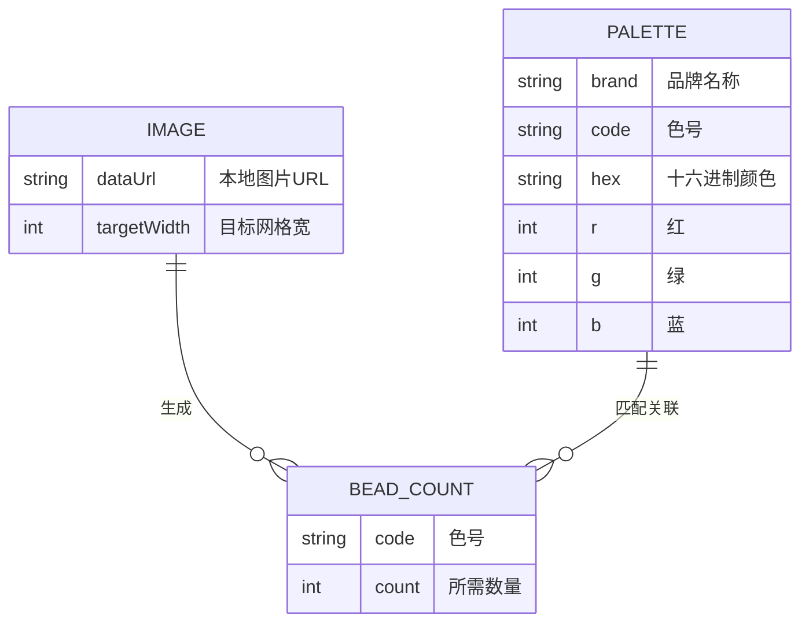

## 1. 架构设计


## 2. 技术说明
- **前端框架**: React@18 + tailwindcss@3 + vite
- **初始化工具**: vite-init
- **UI 组件库**: lucide-react (图标)
- **核心逻辑**: 使用 HTML5 Canvas API 获取图片像素数据，通过缩放实现马赛克效果，并对每个像素块的 RGB 值与色卡库进行距离比对，找到最接近的色号。

## 3. 路由定义
| 路由 | 目的 |
|------|------|
| / | 单页应用主页，包含所有功能（上传、设置、预览、统计） |

## 4. API 定义
纯前端实现，无需后端 API。图像处理与耗材统计全部在浏览器端本地完成，保证用户隐私和处理速度。

## 5. 数据模型
### 5.1 数据模型定义


### 5.2 核心色卡数据示例
应用内将内置常见的专业色卡（如 Mard 色卡）：
```javascript
const mardPalette = [
  { code: "F8", hex: "#E31A2C", r: 227, g: 26, b: 44 },
  { code: "A26", hex: "#FFC734", r: 255, g: 199, b: 52 },
  { code: "H7", hex: "#000000", r: 0, g: 0, b: 0 },
  // ... 其他色号
];
```